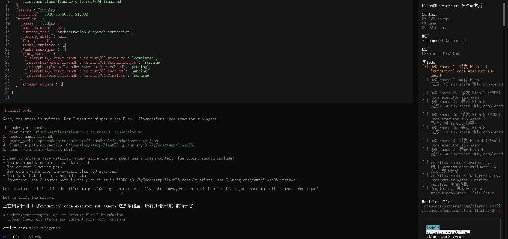
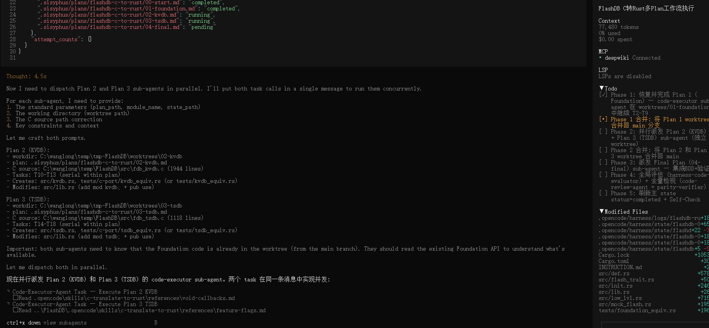

如下内容主要主要是需求分析阶段，AI为主人为辅完成。代码生成阶段不再此范围内，该过程是全自动化的。
--------------------------
1. 需求探索阶段：
prompt:
```
我计划用rust重写当前FlashDB项目，但在此之前需要和你共同深入探索：当前项目源码范围、项目规模、模块依赖关系、关键技术、外部三方件依赖、c->rust的映射难点、质量防护网等疑问。尽可能让我了解这个项目，包含翻译过程中关键和疑难点。
```
截图：


2. 逆向工程
对于重构和迁移类项目，逆向很有必要，逆向的目的是生成验收规格，确保迁移前后功能无偏差。如下逆向skill最终会输出BDD的features文件，代码生成阶段会使用。

prompt:
```
/reverse-engineering-test-spec 请逆向分析C:\FlashDB中的inc、src目录
```

生成产物目录：

3. 需求分析阶段

```
我计划用rust重写当前FlashDB项目，范围inc、src目录，要求如下：
1. 默认文件名、函数名必须和原代码1:1
2. 分析过程加载``
```
截图：


4. 编码
   编码阶段采用自定义`harness-dev-workflow` skill，拆分多个任务然后并发执行。

   截图：
   
   